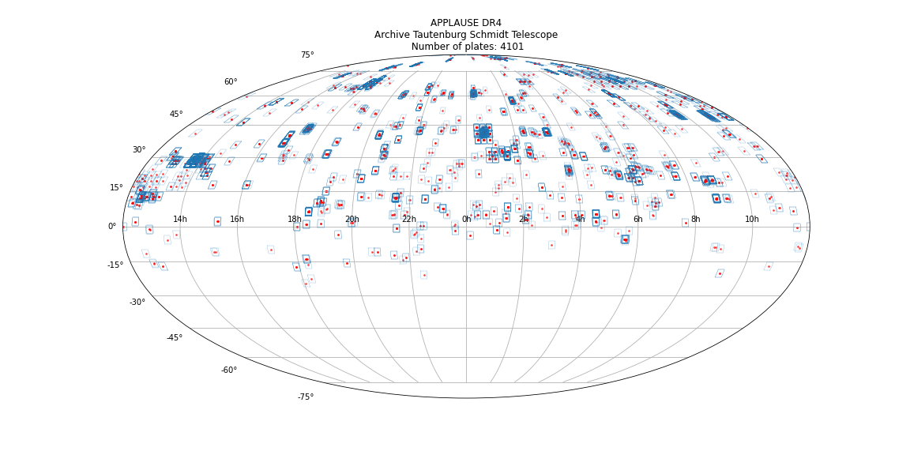

# **Plotting astronomical data**

## About

This example shows how access the data via [TAP/VO](https://ned.ipac.caltech.edu/Documents/Guides/Interface/TAP) from external database and to use REANA to plot this astronomical data using a Python script.
## Structure

### 1.Input Data
[APPLAUSE](https://www.plate-archive.org/cms/home/) (Archives of Photographic PLates for Astronomical USE) is a collection of photographic plate data which can be accessed by  SQL queries.
The data is accesses is via TAP/VO to a website (www.plate-archive.org).
### 2.Source code
Python script `plotplates.py` queries this archive table and creates plots based on retrieved data.
This code will perform following steps:
##### 1.Retrieve the data
 SQL retrieves data with queries to public data using the TAP protocol.
##### 2.Prepare archive access
```
x_url = 'https://www.plate-archive.org/tap'
tap_session = requests.Session()
tap_service = vo.dal.TAPService(x_url, session=tap_session)
lang='PostgreSQL'

```
##### 3.Query archive table for all available archives
```
qry = "Select archive_id, archive_name, num_plates from applause_dr4.archive order by archive_id"
tap_result = tap_service.run_sync(qry, language=lang)
dfa = tap_result.to_table().to_pandas()

```
##### 4. Load the DataFrame by:
```
dfa
```
This should give you all the Query archive table for all available archives according to the archive id.
##### 5. Loop through the archives
```
for index, row in dfa.iterrows():
    if(row['archive_id']==401):
        create_plot(row['archive_id'], row['archive_name'], row['num_plates'])
```
By changing the **`archive_id`** you will be able to create different [Mollweide Diagrams](http://master.grad.hr/hdgg/kog_stranica/kog15/2Lapaine-KoG15.pdf) plotting the size of the observed area (FoV) of each single plate from each archive.
### 3.Environment
For this analysis to run we need many libraries included at the beginning of the source file, so we can use an environment based on `jupyter/scipy-notebook` with some additional libraries useful for astronomical data handling.
### 4.Running the example on REANA
```
version: 0.9.0
inputs:
  files:
  - plotplates.py
workflow:
  type: serial
  specification:
    steps:
        - environment: 'gitlab-p4n.aip.de:5005/p4nreana/reana-env:py311-astro.10125'
          commands:
          - mkdir -p imgdr4
          - python plotplates.py
outputs:
  files:
    - imgdr4/dr4_archive_401.png


```

### 5.Output 
The output should produce `dr4_archive_401.png` in the folder `imgdr4`.
It should look like this:
{width=50%}


